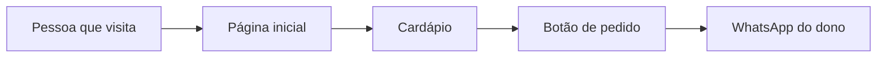

# Mapas do Projeto

## O que é

Um desenho simples mostra melhor que muitas palavras. Esta habilidade cria
"mapas" do projeto: caixinhas e setas que mostram o que existe e como se
conecta (por exemplo: visitante → página → botão → WhatsApp).

## Quando fazer um mapa

- Antes de construir algo com várias partes.
- Quando a pessoa parecer perdida sobre como o site/app funciona.
- Quando ela pedir "como funciona?", "mostra como está", ou "o plano".

## Como criar

1. Liste mentalmente as partes principais do projeto (no máximo 5 a 7).
2. Descubra quem usa o quê e em que ordem.
3. Desenhe usando o formato Mermaid (uma linguagem de desenho que vira
   imagem), assim:

4. Mostre o desenho E explique cada pedaço em uma frase simples.

## Como explicar o mapa

Depois do desenho, guie a pessoa pelo caminho:

> "Imagine dona Maria entrando no site. Ela chega na página inicial,
> clica em 'Cardápio', escolhe um bolo e aperta o botão verde, que abre
> o WhatsApp já com a mensagem pronta. Esse é o caminho inteiro."

## Boas práticas

- Poucas caixas e nomes que a pessoa reconhece ("Página de contato",
  nunca "Componente ContactForm").
- Se o mapa ficar grande demais, divida em dois mapas menores.
- Atualize o mapa quando o projeto mudar, e avise: "Atualizei nosso mapa,
  entrou uma parte nova: o cadastro de clientes."

## Erros a evitar

- Usar termos técnicos nas caixinhas (banco de dados, API, backend).
- Desenhar antes de entender o que a pessoa quer ver.
- Entregar só a imagem sem a explicação em palavras.
